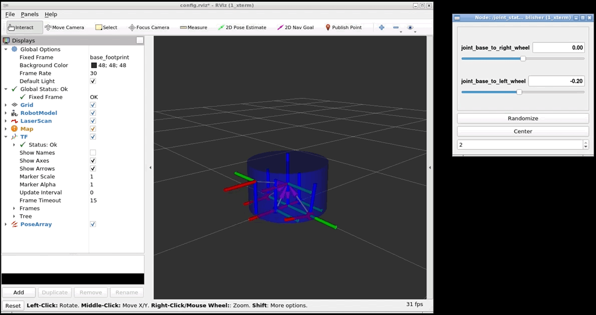

# Robot Simulation (from scratch)

Target is to create a working robot using the URDF, defining all the required links & joints, adding required actuators and sensors, also create launch files to spawn robot in gazebo environment (world).

 

## Structure

```text
.
├── my_rb1_description
│   ├── CMakeLists.txt
│   ├── launch
│   │   └── display.launch
│   ├── package.xml
│   ├── rviz
│   │   └── config.rviz
│   └── urdf
│       └── my_rb1_robot.urdf
├── my_rb1_gazebo
│   ├── CMakeLists.txt
│   ├── launch
│   │   └── my_rb1_robot_warehouse.launch
│   └── package.xml
└── readme.md
```

## Setup

#### Distribution

Use docker for quick-start (for both ROS1 or ROS2):

```sh
# using docker for ROS1
$ docker run -ti --rm --name local-ros-noetic ros:noetic
```

```sh
# using docker for ROS2
$ docker run -ti --rm --name local-ros-humble ros:humble
```

#### Build (Package)

Now, create a catkin workspace, clone the package:

```sh
# setup directory
$ mkdir ~/catkin_ws/src/
$ git clone <repo_name> ~/catkin_ws/src/
```

Install the required packages (dependency) mentioned in `package.xml` using `apt`:

```sh
# check if package is available
$ rospack list
$ rosnode list
```

```sh
# update path to installed packages
$ export ROS_PACKAGE_PATH='/home/user/catkin_ws/src:/opt/ros/noetic/share'
```

To build locally or inside docker use the following commands:

```sh
# execute build
$ cd ~/catkin_ws & catkin_make
$ source devel/setup.bash
```

## Robot (URDF)

The `rb1_robot` is simple four wheel cylinder robot with total weight of `25kg` and accurate physics (i.e. [inertial](https://en.wikipedia.org/wiki/List_of_moments_of_inertia) properties and friction):

#### Links

- `base_footprint` (located at the center bottom of the base cylinder)
- `base_link` (located at the center of the rotation axis that connect the two wheels)
- `right_wheel`
- `left_wheel`
- `front_caster`
- `back_caster`
- `front_laser` (connect with `base_link` and rotated `180` degrees in position)


## Launch

The `display.launch` launch file contains the followings nodes:

- `joint_state_publisher_gui` (publishing joint state values for URDF)
- `robot_state_publisher` (publish the state of a robot to [tf2](http://ros.org/wiki/tf2))
- `rviz` (for visualization and control)

```sh
roslaunch my_rb1_description display.launch
```



The `my_rb1_robot_warehouse.launch` launch file will spawn the robot in warehouse simulation inside gazebo. The robot read velocity message from `/cmd_vel` and publish laser data on `/scan` along with odometry data on `/odom`.

The `my_rb1_robot_warehouse.launch` launch file also contains the followings node along with above mentioned nodes:

- `spawn_model` (to spawn the model in gazebo environment)

```sh
roslaunch my_rb1_gazebo my_rb1_robot_warehouse.launch
```

```sh
$ rostopic pub /cmd_vel geometry_msgs/Twist "linear:
  x: 0.2
  y: 0.0
  z: 0.0
angular:
  x: 0.0
  y: 0.0
  z: 0.0"
```


```sh
# to view the laser scan
$ rostopic echo /scan
```

```sh
# to view the odometry
$ rostopic echo /odom
```

## Node/Service

The ROS service named `/rotate_robot` make the robot rotate for a specific number of degrees (defined by the user), the service usage odometry data from `/odom` and a custom message to communicate `Rotate.srv` as defined below:

- A **request** that contains an integer field, named `degrees`, to specify the number of degrees to rotate
- A **response** that contains an string, named `result`, that specifies if the rotation has been completed successfully or not.

To start the service launch the `rotate_service.launch` file:

```sh
roslaunch my_rb1_ros rotate_service.launch
```

and, to call the service using following commands:

```sh
rosservice call /rotate_robot "degrees: -60"
```


## Specifications

#### Sensors

The actuators and sensors to the robot in order for it to control the motors of the robot and perceive its surroundings.

- `libgazebo_ros_diff_drive.so` from `differential_drive_controller` linked to joints.
- `libgazebo_ros_laser.so` from `gazebo_ros_head_hokuyo_controller` attached to `front_laser` publish on `/scan`.

#### Conversions

- `Radians = Degrees × (π/180)`.
- `Degrees = Radians × (180/π)`.

## Roadmap

- [x] Part 1 : Define robot, launch, and simulation.

  - [x] Task 1 : Creating a simple URDF file of a mobile robot.
  - [x] Task 2 : Spawn robot in simulation using launch file.
  - [x] Task 3 : Add sensor plugins for actuators and sensors.

- [x] Part 2 : Create ros service to rotate the robot for an specific number of degrees.

See the [open issues](https://github.com/llabhishekll/python-project-template/issues) for a full list of proposed features (and known issues).

## Tools

System tool/modules used for project development.

- `Applications` : [vs-code](https://code.visualstudio.com/), [ros-extensions](https://marketplace.visualstudio.com/items?itemName=ms-iot.vscode-ros) and [docker-desktop](https://docs.docker.com/get-docker/).
- `ROS` : [ros-docker-images](https://hub.docker.com/_/ros/) (`humble`, `noetic`) or [build-source](https://www.ros.org/blog/getting-started/).

## License

Distributed under the MIT License. See `LICENSE.txt` for more information.
